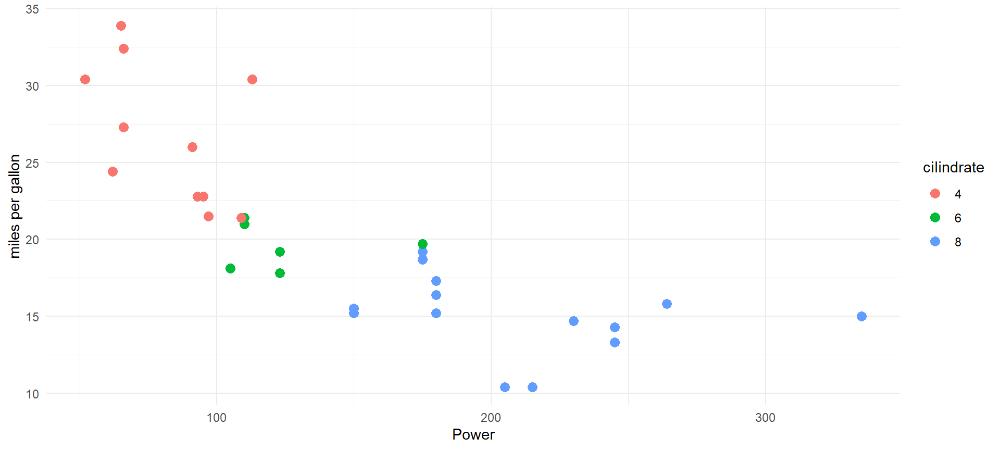
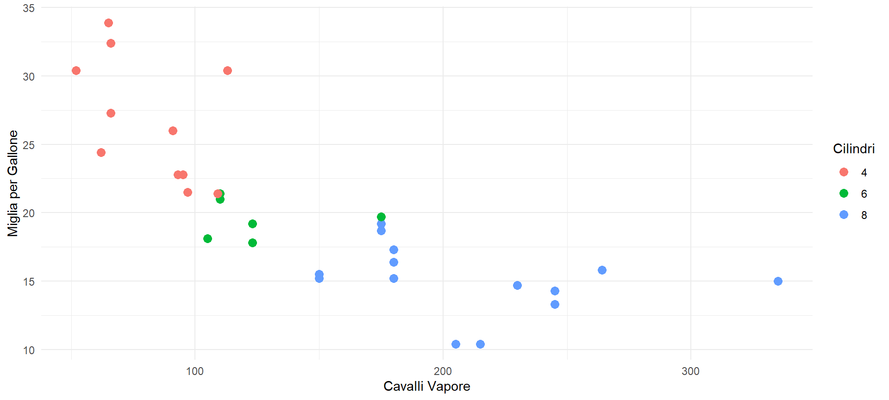

## Agenda
::: incremental
1. What is Quarto
2. Managing Documents on Quarto
3. Conclusive remarks
:::

::: footer
Quarto
:::


# Introduction
::: footer
Quarto
:::

## What is Quarto and What Its Role {.smaller}


### <span style="color: orange;">An open-source scientific and technical publishing system </span>
::: incremental
:::: {.columns}

::: {.column width="40%"}
- Create  dynamic content with **Python, R, Julia**, and **Observable**.

- Publish reproducible, production quality **articles**, **presentations**, dashboards, **websites**, blogs, and books in <span style="color: orange;"> HTML, PDF, MS Word, ePub </span>, and more. 
:::

::: {.column width="60%"}
- Share **knowledge** and **insights** organization-wide by publishing to Posit Connect, Confluence, or other publishing systems.

- Write using Pandoc markdown, including equations, citations, crossrefs, figure panels, callouts, advanced layout, and more.
:::

::::

:::
::: footer
Quarto
:::

# Managing Documents
::: footer
Quarto
:::

## Start Quarto

-   `quarto install`
-   `quarto create`: Create a new Quarto document. File>New File>Quarto Doc
-   `quarto type of doc `: Specify what kind of document you want to realize
-   `quarto render`: Render the document to the specified output format

::: footer
Quarto
:::

## Create a presentation 1/3 {.smaller}

<br/>

**YAML**

```r
---
title: "Quarto Presentation"
subtitle: "Marketing Strategy Short Presentation"
format:
  revealjs: 
    theme: default
    css: styles.css
    slide-number: true
    chalkboard: 
      buttons: false
    logo: "https://i.pinimg.com/originals/2e/81/3c/2e813c67b8b948fe1b2aa4ea1daaf129.png"
    footer: "[Quarto]"
---
```
::: footer
Quarto
:::
## Create a presentation 2/3 {.smaller}

::: {.fragment .fade-in}
**Generate a slide**
```r
## + space + Title
```
:::

::: {.fragment .fade-in}
**Generate a head-slide**
```r
# + space + Title
```
:::

::: {.fragment .fade-in}
**Generate an incremental list**
```r
::: {.fragment .fade-in}
The content of your first bullet point
:::
```
:::

::: footer
Quarto
:::

## Create a presentation 3/3 {.smaller}

::: {.fragment .fade-in}
**Layout and graphic customization**
```r
Create a .css file >
Include rules > 
Apply on Quarto
```
:::

::: {.fragment .fade-in}
I will change the colour of this sentence
:::
::: {.fragment .fade-in}
```r
<span style="color: orange;"> I will change the colour of this sentence </span>
```
:::
::: {.fragment .fade-in}
<span style="color: orange;"> I will change the colour of this sentence </span>
:::
::: footer
Quarto
:::
## Slide Backgrounds {background-image="https://www.newsmanmagazine.it/wp-content/uploads/2022/05/4-1.png"}

```r
## Titolo della Slide {background-image="https://example.com/path/to/image.jpg"}
```

<span style="color: white;"> Set the </span> `background` <span style="color: white;"> attribute on a slide to change the background color (all CSS color formats are supported).</span>

<span style="color: white;">You can also use the following as a slide background:</span>

- <span style="color: white;">  An image: </span> `background-image`

-   <span style="color: white;"> A video: </span>`background-video`

- <span style="color: white;">  An iframe: </span>`background-iframe`

::: footer
Quarto
:::


## Working with Quarto: {.smaller}
### Handling Coding Syntax


-   Calling the software (``` + Software; then close)
-   Generating Boxes
-   Automatically recognize commands

``` r 
library(dplyr)

# Filtra i personaggi che sono umani e hanno specificato l'altezza e il peso
umani <- starwars %>%
  filter(species == "Human", !is.na(height), !is.na(mass))

# Seleziona colonne di interesse: nome, altezza e peso
umani_selezionati <- umani %>%
  select(name, height, mass)

# Riassume l'altezza media e il peso medio per genere
riassunto <- umani_selezionati %>%
  group_by(gender) %>%
  summarise(
    altezza_media = mean(height, na.rm = TRUE),
    peso_medio = mean(mass, na.rm = TRUE)
  )

```
::: footer
Quarto
:::


# Integrate Code and Graphs {.smaller}


::: {.cell}

```{.r .cell-code}
library(ggplot2)

ggplot(mtcars, aes(x = hp, y = mpg)) +
  geom_point(aes(color = factor(cyl)), size = 3) +
  labs(x = "Power", y = "miles per gallon", color = "cilindrate") +
  theme_minimal()
```

::: {.cell-output-display}
{width=960}
:::
:::

::: footer
Quarto
::: 
# Behind the code

1. **```{r}**
2. <span style="color: red;">  | echo: true </span>
3. <span style="color: red;"> | fig-width: 10 </span>
4. <span style="color: red;"> | fig-height: 4.5 </span>
5. **library(ggplot2) **

ggplot(mtcars, aes(x = hp, y = mpg)) +
  geom_point(aes(color = factor(cyl)), size = 3) +
  labs(x = "Cavalli Vapore", y = "Miglia per Gallone", color = "Cilindri") +
  theme_minimal()

::: footer
Quarto
:::

# echo: false

In this case, changing the first line of the code, the box is hidden within the syntax of the slide.


::: {.cell}
::: {.cell-output-display}
{width=960}
:::
:::

::: footer
Quarto
:::
## Absolute position

Position images or other elements at precise locations

::: {.cell}

```{.r .cell-code}
#{.absolute top="170" left="30" width="200" height="200"}
```
:::


::: {.fragment .fade-in}
{.absolute top="250" left="30" width="200" height="200"}

:::

{.absolute .fragment top="250" right="130" width="300"}

{.absolute .fragment bottom="70" right="500" width="300"}

::: footer
Quarto
:::

# Conclusive Remarks

::: footer
Quarto
:::

## Quarto vs Rmarkdown vs Jupiter

::: incremental
:::: {.columns}

::: {.column width="40%"}
<span style="color: green;">**Pro**</span>

- More **languages** support

- More **customization** and output options
:::

::: {.column width="60%"}
<span style="color: orange;">**Cons**</span>

- Learning Curve

- **R** integration
:::

::::

:::
::: footer
Quarto
:::

## Quarto vs LaTeX

::: incremental
:::: {.columns}

::: {.column width="40%"}
<span style="color: green;">**Pro**</span>

- **Easy** to use

- **Naturally** integrated code
:::

::: {.column width="60%"}
<span style="color: orange;">**Cons**</span>

- **Granural control**

:::

::::

:::

::: footer
Quarto
:::
# Thank You!
::: footer
Lorenzo Morgante
:::


